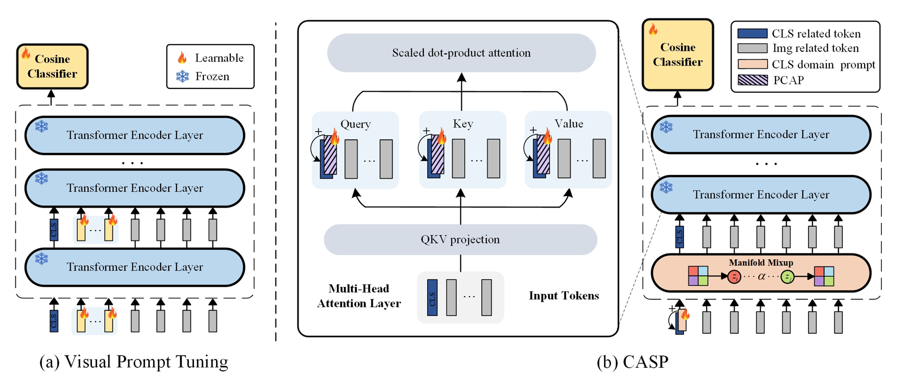

# Casp

Code for CASP: Few-Shot Class-Incremental Learning with CLS Token Attention Steering Prompts



# Abstract

Abstract Few-shot class-incremental learning (FSCIL) presents a core challenge in continual learning, re quiring models to rapidly adapt to new classes with very limited samples while mitigating catas trophic forgetting. Recent prompt-based methods, which integrate pretrained backbones with task-specific prompts, have made notable progress. However, under extreme few-shot incremen tal settings, the model’s ability to transfer and generalize becomes critical, and it is thus essential to leverage pretrained knowledge to learn feature representations that can be shared across future categories during the base session. Inspired by the mechanism of the CLS token, which is similar to human attention and progressively filters out task-irrelevant information, we propose the CLS Token Attention Steering Prompts (CASP). This approach introduces class-shared trainable bias parameters into the query, key, and value projections of the CLS token to explicitly modulate the self-attention weights. To further enhance generalization, we also design an attention pertur bation strategy and perform Manifold Token Mixup in the shallow feature space, synthesizing potential new class features to improve generalization and reserve the representation capacity for upcoming tasks. Experiments on the CUB200, CIFAR100, and ImageNet-R datasets demon strate that CASP outperforms state-of-the-art methods in both standard and fine-grained FSCIL settings without requiring fine-tuning during incremental phases and while significantly reducing the parameter overhead.

# Result


# Environment

```
conda create --name CASP python=3.9

conda activate CASP

pip install -r requirements.txt
```

# Dataset

Follow the instruction in [CEC](https://github.com/icoz69/CEC-CVPR2021).

# Training scripts

cub200

```
python -m pdb train_my.py  -dataset cub200 -base_mode ft_dot -new_mode avg_cos -gamma 0.1 -lr_base 1e-2 -lr_new 1e-3 -decay 0.0005 -epochs_base 30 -epochs_new 0 -schedule Cosine  -gpu 0 -temperature 16 -start_session 0 -batch_size_base 64 -seed 1 -vit  -out 'Casp' -dataroot /workspace/huangshuai/CEC-CVPR2021/data/ -mix_layer 0 -mix 0.5 -project Casp
```

cifar100

```
python -m pdb train_my.py  -dataset cifar100 -base_mode ft_dot -new_mode avg_cos -gamma 0.1 -lr_base 1e-2 -lr_new 1e-3 -decay 0.0005 -epochs_base 30 -epochs_new 0 -schedule Cosine  -gpu 0 -temperature 16 -start_session 0 -batch_size_base 64 -seed 1 -vit  -out 'Casp' -dataroot /workspace/huangshuai/CEC-CVPR2021/data/ -mix_layer 5 -mix 0.05 -project Casp
```

ImageNet-R

we reproduce CASP_imageNet-R under the SEC-prompt framework  [SEC](https://github.com/yeyeyeye33/SEC-Prompt). 

# Acknowledgement

[PriViLege](https://github.com/KHU-AGI/PriViLege)

[SEC](https://github.com/yeyeyeye33/SEC-Prompt)

[APT](https://github.com/HaoranChen/Additive-Prompt-Tuning)

[FACT](https: //github.com/zhoudw-zdw/CVPR22-Fact)
